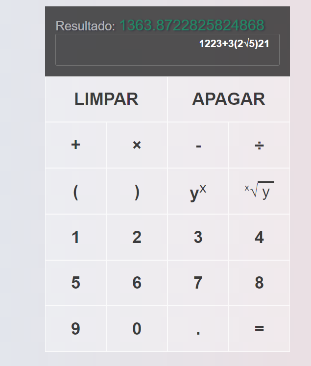

# Calculator-Parsing-from-scratch
Written in mostly `functional paradigm`, this app parses text in a html input section into a mathematical expression that can be will be solved and display using css and javascript (IT DOES NOT USE built-in `eval` from javascript)

* Obs: All the "heavy lifting" can be found at resultado.js*
## Steps:
- Run index.html on local server

## Preview:
  

